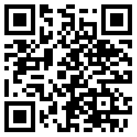



# mobile-lock 

> 移动端手势锁屏插件

## Preview

    
[https://lock.slane.cn](https://lock.slane.cn)


## Usage

1. 使用npm安装（待过些天发布）
1. 直接下载`mobile-lock.js`使用，兼容AMD、CMD规范

```html
  <script src="./mobile-lock.js"></script>
  <script>
        window.Lock.init({
          element: '#J_canvas',
          num: 3,
          length: 5,
          ...
          
        })
        window.Lock.switchState('set')
  </script>
```

## Api

### `init(options)`初始化函数

**{Object} options参数说明**

参数 | 类型 | 必填 | 描述 |
--- | --- | --- | --- |
`element` | String | `是` | 当前组件依赖的DOM元素，目前仅支持选择符API，eg: `"#J_canvas"`。
`num` | Number | `是` | 圆圈组成n*n方阵的阶数。
`length` | Number | `是` | 设置密码时最少选中点数。
`deficiency` | Function | `否` | 输入密码不足设置的`length`个点时，执行的回调函数。
`firstSetPwd` | Function | `否`| 组件状态为`set`，且第一次设置密码成功时的回调函数。
`setSuccess` | Function | `否` | 组件状态为`set`，且第二次设置密码成功，并储存密码到`localSorage`时的回调函数。
`setFail` | Function | `否` | 组件状态为`set`，且第二次设置密码失败时的回调函数。
`checkSuccess` | Function | `否` | 组件状态为`check`，验证密码与`localSorage`存储的密码一致时，执行的回调函数。
`checkFail` | Function | `否` | 组件状态为`check`，验证密码与`localSorage`存储的密码不一致时，执行的回调函数。

### `switchState(state)`切换组件状态函数
**state参数说明**

参数 | 类型 | 必填 | 描述 |
--- | --- | --- | --- |
state|String|`否`|当值为`"set"`时，切换组件到设置密码状态，当值为`"check"`时，切换组件到验证本地存储密码状态。当不传该参数时，自动在`"set"`和`"check"`之间互相切换


## 实现思路

1. 利用`canvas`大小，构造圆圈坐标数据

```javascript
  /**
    * 计算每个圆圈的位置信息
    * @method _caculatePosition
    * @private
    */
  _caculatePosition: function () {
      var n = this.num
      var r = this._r
      this._circles = []
      this._touchedList = []
      for (var i = 0; i < n; i++) { // 行
          for (var j = 0; j < n; j++) { // 列
              this._circles.push({
                  x: j * 4 * r + 2 * r,
                  y: i * 4 * r + 2 * r,
                  r: r,
                  touched: false, // 是否已被选中
              });
          }
      }
  }
```

2. 根据圆圈坐标数据，利用`canvas`API画出对应圆圈样式

```javascript
  /**
    * 填充圆圈样式
    * @method _drawCircle
    * @private
    */
  _drawCircle: function () {
      var circles = this._circles;
      for (var i = 0; i < circles.length; i++) {
          this._content.beginPath();
          this._content.arc(circles[i].x, circles[i].y, circles[i].r, 0, 2 * Math.PI, false);
          if (!circles[i].touched) {
              // 未点击状态
              this._content.strokeStyle = "#bbb";// 画空心圆
              this._content.stroke();
          } else {
              // 已点击状态
              this._content.fillStyle = "#ffa724";// 画实心圆
              this._content.strokeStyle = "#fd8d00";// 画空心圆
              this._content.fill();
              this._content.stroke();
          }
          this._content.closePath();
      }
  }
```

3. 根据圆圈坐标中`touch`字段，和手指的位置，利用`canvas`API画出圆圈之间，圆圈与手指之间的线条。

```javascript
/**
  * 构造圆圈间、圆圈与手指间线条
  * @method _drawCircle
  * @private
  */
  _drawLine: function (position) {
      this._clearCanvas()
      this._drawCircle()
      for (var i = 0; i < this._touchedList.length - 1; i++) {
          var startIndex = this._touchedList[i]
          var endIndex = this._touchedList[i + 1]
          var start = this._circles[startIndex]
          var end = this._circles[endIndex]
          this._content.beginPath();
          this._content.strokeStyle = "#e0281e";// 画空心圆
          this._content.moveTo(start.x, start.y);
          this._content.lineTo(end.x, end.y);
          this._content.stroke();
      }
      if (!position || this._touchedList.length == 0) return
      startIndex = this._touchedList[this._touchedList.length - 1]
      start = this._circles[startIndex]
      end = position
      this._content.strokeStyle = "#e0281e";// 画空心圆
      this._content.beginPath();
      this._content.moveTo(start.x, start.y);
      this._content.lineTo(end.x, end.y);
      this._content.stroke();
  }
```

4. 在画布上添加事件，通过touchmove事件不断触发`canvas`重绘（画圆，画线条）。通过touchend事件，根据组件的状态，触发对应的设置密码或验证密码的函数。

```javascript
/**
  * 绑定DOM事件到canvas元素
  * @method _addEvent
  * @private
  */
  _addEvent: function () {
      var that = this
      this.element.addEventListener('touchstart', function (event) {
          var position = that._getPosition(event.touches[0])
          that._touchCircle(position)
      })
      this.element.addEventListener('touchmove', function (event) {
          var position = that._getPosition(event.touches[0])
          that._touchCircle(position)
          that._drawLine(position)
      })
      this.element.addEventListener('touchend', function () {
          that._drawLine()
          var password = that._touchedList.join('')
          if (that._type == 'set') {
              that._setPassword(password)
          } else if (that._type == 'check') {
              that._checkPassword(password)
          }
      })
  },
```

5. touchend事件结束后，如果组件为`set`设置状态，与上一次输入结果校验，如果一致，则直接保存到`localStorage`

```javascript
/**
  * 设置密码
  * @method password
  * @private
  */
  _setPassword: function (password) {
      if (this._touchedList.length < this.length && this._touchedList.length > 0) {
          // 不足用户设置长度，执行对应回调函数
          this._useCallback('_deficiency')
      } else if(this._touchedList.length > 0) {
          if (this._lastTouchedList.length == 0) {
              // 第一次输入图案
              this._lastTouchedList = password
              this._useCallback('_firstSetPwd')
          } else {
              // 第二次输入图案
              if (this._lastTouchedList == password) {
                  // 两次密码一致
                  this._lastTouchedList = ''
                  this.util.setStorage('mobile_lock', password)
                  this._useCallback('_setSuccess')
              } else {
                  // 两次密码不一致
                  this._lastTouchedList = ''
                  this._useCallback('_setFail')
              }
          }
      }
      // 重置画布
      this._resetCanvas()
  }
```

6. touchend事件结束后，如果组件为`check`验证密码状态，取出`localStorage`中的密码比较，如果一致，则调用对应的回调函数。

```javascript
/**
  * 校验密码
  * @method _checkPassword
  * @private
  */
  _checkPassword: function (password) {
      var localPwd = Lock.util.getStorage('mobile_lock')
      if (localPwd == password) {
          this._useCallback('_checkSuccess')
      } else {
          this._useCallback('_checkFail')
      }
      // 重置画布
      this._resetCanvas()
  }
```

7. 封装组件，暴露对应的`API`，暴露对应的回调函数钩子。